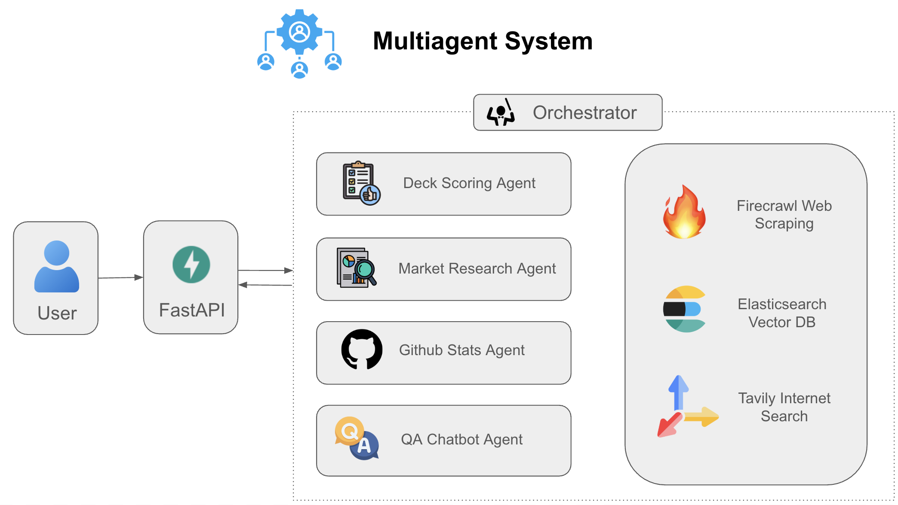
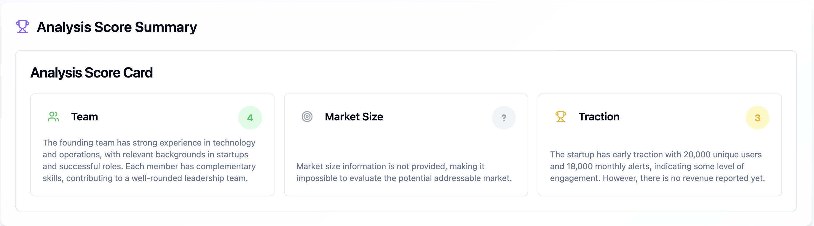
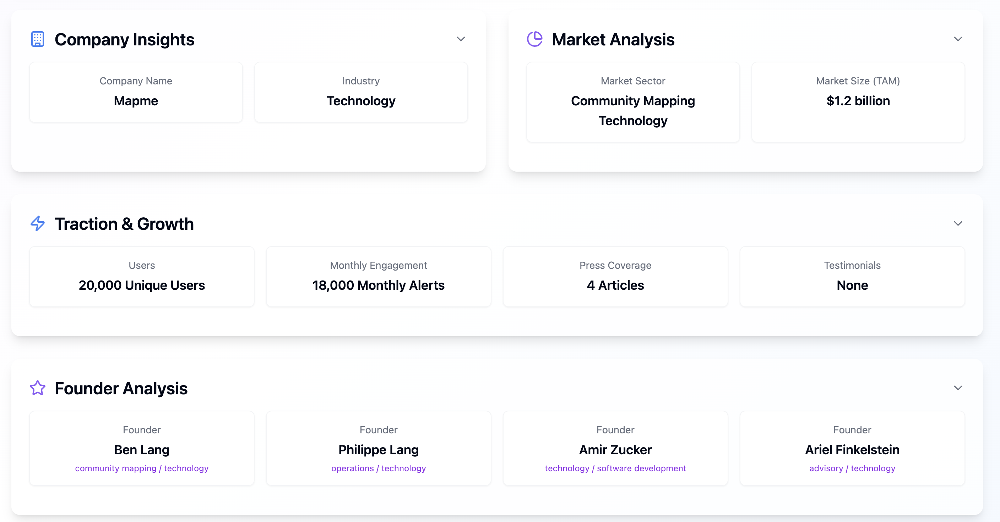

# 🚀 Deck Insight

**Deck Insight** is an open-source AI tool to **analyze, summarize, and score startup pitch decks** automatically.

- 📄 Upload a startup's pitch deck (PDF)
- 🎥 Provide a startup's pitch video transcript (from audio/video)
- 📋 Extracts and structures key information
- 🧠 Extracts claims, assumptions, and missing evidence from decks or videos
- ⚖️ Generates rule-based investor simulation scores, hard questions, and fix lists
- 🏆 Scores the startup based on a **custom evaluation rubric** (for investors, accelerators, competition judges)
- 🌎 Calculates **market size** estimates from real-time internet data
- 🛠️ Pulls insights from the startup’s GitHub repositories (for developer tools/open-source startups)
- 💬 Includes a **QA chatbot** to ask natural language questions about the startup

Fully extensible and customizable for your workflows.  
Perfect for investors, analysts, startup competitions, accelerators, and ecosystem builders.



Observability on AI agents are implemented through LangSmith.

---

## 🛠 Output Preview

> **Note**: This repository contains only the backend implementation. The screenshots below are from a separate frontend integration built using [Lovable](https://lovable.dev), showcasing how the API endpoints can be consumed and displayed in a user interface.





---

## 🛠 How It Works

1. Upload or provide a link to the startup’s pitch deck (PDF).
2. The system extracts key information and fills a structured profile.
3. Applies a scoring rubric customized to your preferences.
4. Estimates market size from online data sources.
5. (Optional) If it's a developer tool, pulls additional GitHub repo data.
6. Ask the built-in chatbot for any questions about the startup profile.
7. (Optional) Upload a pitch video/audio or transcript for investor-style critique.

---

## 📦 Installation

1. Clone the repository:
```bash
git clone https://github.com/hitesh-ag1/deck-insight.git
cd deck-insight
```

2. Create and activate a virtual environment:
```bash
python -m venv venv
source venv/bin/activate
```

3. Install the dependencies
```bash
pip install -r requirements.txt
```

4. Set up the environment variables:
```bash
cp .env.example .env
```
Add your API keys to .env (Gemini-only setup):
- `GOOGLE_API_KEY`
- `TEXT_MODEL` (e.g., `gemini-1.5-pro`)
- `VISION_MODEL` (e.g., `gemini-1.5-flash`)
- `EMBEDDINGS_MODEL` (e.g., `text-embedding-004`)
- `MARKET_MODEL` (optional, use a faster model like `gemini-2.5-flash` for market research)
- `SPEECH_LANGUAGE` (optional, default `en-US`)
- `GOOGLE_APPLICATION_CREDENTIALS` (path to GCP service account JSON for Speech-to-Text)
- `CORS_ORIGINS` (optional, comma-separated list of allowed frontend origins)

Example `.env`:
```bash
GOOGLE_API_KEY=your_gemini_key
TEXT_MODEL=gemini-2.5-pro
VISION_MODEL=gemini-2.5-flash
EMBEDDINGS_MODEL=text-embedding-004
MARKET_MODEL=gemini-2.5-flash
SPEECH_LANGUAGE=en-US
GOOGLE_APPLICATION_CREDENTIALS=/absolute/path/to/service-account.json
CORS_ORIGINS=http://localhost:3000,http://127.0.0.1:3000
```

Make sure Speech-to-Text is enabled in your GCP project tied to the service account.

5. Run FastAPI server:
```bash
uvicorn main:app --reload
```

For server-side video/audio transcription, `ffmpeg` must be installed and available in PATH.

### Background Worker (Celery + Redis)
Start Redis:
```bash
redis-server
```

Start Celery worker (thread pool; avoids macOS fork issues):
```bash
celery -A jobs.celery_app.celery_app worker -P threads -c 4 -l info --without-gossip --without-mingle --without-heartbeat
```

Optional Redis URL override:
```bash
CELERY_REDIS_URL=redis://localhost:6379/0
```

6. Test the API with sample decks under ```examples``` folder:
```bash
# Use any deck from the examples/ directory to test
curl -X POST "http://localhost:8000/analyze-complete" \
  -H "Content-Type: application/json" \
  -d '{"file_path": "examples/MapMe-Pitch-Deck.pdf"}'

# Or use the Swagger UI at http://localhost:8000/docs to test interactively
```
---


## 🏗️ How It’s Built

**Startup Deck Copilot** is architected using modular AI agents orchestrated with the [LangGraph](https://langgraph.readthedocs.io/) framework, all packaged behind a FastAPI server for easy deployment and API access.

### ✨ Core Components

- **Pitch Deck Scorer**  
  - Inputs images of pitch deck slides
  - Uses **Gemini Flash** for OCR and visual understanding
  - Generates a structured summary of key startup information (problem, solution, traction, market, business model, team, funding) using **Gemini**
  - Scores the startup against a predefined, customizable rubric

- **Market Research Agent**  
  - Uses Tavily Search to research sector, market size, and competitor landscape
  - Summarizes search results using **Gemini**

- **GitHub Viewer Agent**  
  - Uses Firecrawl to scrape the startup’s GitHub repositories
  - Summarizes repository activity, health, and community engagement

- **QA Chatbot**  
  - Built as a Retrieval-Augmented Generation (RAG) system
  - Indexes startup profiles into Elasticsearch
  - On query, retrieves most relevant context and answers using **Gemini**

- **Supervisor Agent**  
  - Orchestrates the full analysis pipeline:
    1. **Pitch Deck Scorer**
    2. **Market Research Agent**
    3. **GitHub Viewer Agent** (conditional)

---

### 🛠️ Stack

| Layer | Technology |
|:---|:---|
| Vision Model | Gemini Flash (2.5/2.0 variants) |
| Language Model | Gemini (2.5/2.0 variants) |
| Agent Orchestration | [LangGraph](https://www.langchain.com/langgraph) |
| API Server | [FastAPI](https://fastapi.tiangolo.com) |
| Web Search | [Tavily API](https://tavily.com/) |
| Web Scraping | [Firecrawl](https://firecrawl.dev/) |
| Vector Database (RAG) | [Elasticsearch](https://www.elastic.co/elasticsearch/) |


---

## 📚 API Endpoints

### Summary
- `POST /analyze-complete`: Full pitch deck analysis (PDF upload)
- `POST /analyze-pitch-deck`: Pitch deck scoring + summary (PDF upload)
- `POST /analyze-market-size`: Market research (JSON body)
- `POST /analyze-github-repository`: GitHub repository analysis (JSON body)
- `POST /chat-assistant`: Q&A over analyzed deck (JSON body)
- `POST /analyze-video-pitch`: Pitch video/audio upload with transcription + investor scoring
- `POST /analyze-video-pitch-text`: Pitch transcript analysis (JSON body)
- `POST /extract-claims`: Claim & assumption extraction (file upload)
- `POST /extract-claims-text`: Claim & assumption extraction (JSON body)
- `POST /score-startup`: Claim vs reality comparison + final verdict
- `POST /investor-simulation`: Rule-based investor simulation only
- `POST /skepticism-flags`: Unsupported claim flags
- `POST /final-verdict`: Verdict + blockers + next actions
- `POST /investor-personas`: Investor persona questions (JSON body)
- `GET /jobs/{job_id}`: Job status/result

See `FRONTEND_INTEGRATION.md` for recommended async frontend flows and polling patterns.

### Request Details

`POST /analyze-complete`
- Content-Type: `multipart/form-data`
- Body:
  - `file`: PDF file
- Response:
```json
{ "job_id": "...", "status": "pending" }
```
- Example:
```bash
curl -X POST "http://localhost:8000/analyze-complete" \
  -H "Content-Type: multipart/form-data" \
  -F "file=@/path/to/deck.pdf"
```

`POST /analyze-pitch-deck`
- Content-Type: `multipart/form-data`
- Body:
  - `file`: PDF file
- Response:
```json
{ "job_id": "...", "status": "pending" }
```
- Example:
```bash
curl -X POST "http://localhost:8000/analyze-pitch-deck" \
  -H "Content-Type: multipart/form-data" \
  -F "file=@/path/to/deck.pdf"
```

`POST /analyze-market-size`
- Content-Type: `application/json`
- Body (example shape):
```json
{
  "company_name": "Acme",
  "business_description": "B2B SaaS for logistics...",
  "industry": "Logistics",
  "region": "Global"
}
```
- Example:
```bash
curl -X POST "http://localhost:8000/analyze-market-size" \
  -H "Content-Type: application/json" \
  -d '{"company_name":"Acme","business_description":"B2B SaaS for logistics...","industry":"Logistics","region":"Global"}'
```

`POST /analyze-github-repository`
- Content-Type: `application/json`
- Body:
```json
{
  "repository_url": "https://github.com/org/repo"
}
```
- Example:
```bash
curl -X POST "http://localhost:8000/analyze-github-repository" \
  -H "Content-Type: application/json" \
  -d '{"repository_url":"https://github.com/org/repo"}'
```

`POST /chat-assistant`
- Content-Type: `application/json`
- Body:
```json
{
  "message": "What is the problem statement?",
  "thread_id": null,
  "model": "gemini-2.5-pro",
  "agent_config": {}
}
```
- Example:
```bash
curl -X POST "http://localhost:8000/chat-assistant" \
  -H "Content-Type: application/json" \
  -d '{"message":"What is the problem statement?","thread_id":null}'
```

`POST /analyze-video-pitch`
- Content-Type: `multipart/form-data`
- Body:
  - `file`: video/audio file (e.g., mp4, mov, mp3, wav)
- Response:
```json
{ "job_id": "...", "status": "pending" }
```
- Example:
```bash
curl -X POST "http://localhost:8000/analyze-video-pitch" \
  -H "Content-Type: multipart/form-data" \
  -F "file=@/path/to/pitch.mp4"
```

`POST /analyze-video-pitch-text`
- Content-Type: `application/json`
- Body:
```json
{
  "transcript": "We are building..."
}
```
- Example:
```bash
curl -X POST "http://localhost:8000/analyze-video-pitch-text" \
  -H "Content-Type: application/json" \
  -d '{"transcript":"We are building..."}'
```

`POST /extract-claims`
- Content-Type: `multipart/form-data`
- Body:
  - `file`: video/audio file or PDF
- Response:
```json
{ "job_id": "...", "status": "pending" }
```
- Example:
```bash
curl -X POST "http://localhost:8000/extract-claims" \
  -H "Content-Type: multipart/form-data" \
  -F "file=@/path/to/pitch.mp4"
```

`POST /extract-claims-text`
- Content-Type: `application/json`
- Body:
```json
{
  "text": "We are building...",
  "source_type": "video"
}
```
- Example:
```bash
curl -X POST "http://localhost:8000/extract-claims-text" \
  -H "Content-Type: application/json" \
  -d '{"text":"We are building...","source_type":"video"}'
```

`POST /score-startup`
- Content-Type: `application/json`
- Body:
```json
{
  "claim_assumptions": { "...": "..." },
  "market_research": { "...": "..." }
}
```
- Example:
```bash
curl -X POST "http://localhost:8000/score-startup" \
  -H "Content-Type: application/json" \
  -d '{"claim_assumptions":{},"market_research":{}}'
```

`POST /investor-simulation`
- Content-Type: `application/json`
- Body:
```json
{
  "claim_assumptions": { "...": "..." },
  "market_research": { "...": "..." }
}
```

`POST /skepticism-flags`
- Content-Type: `application/json`
- Body:
```json
{
  "claim_assumptions": { "...": "..." }
}
```

`POST /final-verdict`
- Content-Type: `application/json`
- Body:
```json
{
  "claim_assumptions": { "...": "..." },
  "market_research": { "...": "..." }
}
```

`GET /jobs/{job_id}`
- Response:
```json
{
  "id": "...",
  "status": "pending|processing|completed|failed",
  "progress": "optional",
  "result": {},
  "error": null
}
```

`POST /investor-personas`
- Content-Type: `application/json`
- Body:
```json
{
  "transcript": "We are building...",
  "model": "gemini-2.5-pro"
}
```
- Response:
```json
{
  "investor_modes": {
    "seed_investor": {"hard_questions": ["How will you acquire first 100 customers?"]},
    "vc_investor": {"hard_questions": ["What is the path to $100M ARR?"]},
    "angel_investor": {"hard_questions": ["Why are you the right team?"]},
    "demo_day": {"hard_questions": ["What traction can you show?"]}
  }
}
```

---

## 🧾 Null Field Mapping (Frontend Integration)

Use this section to fetch data for fields that may be `null` in the main analysis response.

### `/extract-claims` (file)
- **Method:** `POST`
- **Use for:** `claim_assumptions`, `sections`, `normalized_text`
- **Body:** `multipart/form-data`
  - `file`: PDF or video/audio file
- **Response:**
```json
{
  "source_type": "video|deck",
  "transcript": "optional",
  "normalized_text": "...",
  "sections": {"problem": "", "solution": "", "market": "", "traction": ""},
  "claim_assumptions": {
    "claims": {"problem": "", "market_size": "", "differentiation": "", "traction": ""},
    "assumptions": [],
    "promises": [],
    "missing_evidence": [],
    "evidence_present": {"problem": true, "market_size": false}
  }
}
```

### `/extract-claims-text`
- **Method:** `POST`
- **Use for:** `claim_assumptions`, `sections`, `normalized_text`
- **Body:** `application/json`
```json
{ "text": "raw pitch text or transcript", "source_type": "video|deck|text" }
```
- **Response:** same as `/extract-claims`.

### `/score-startup`
- **Method:** `POST`
- **Use for:** `investor_simulation`, `final_verdict`, `top_blockers`, `next_actions`, `likely_rejection`, `claim_vs_reality`, `skepticism_flags`
- **Body:** `application/json`
```json
{
  "claim_assumptions": { "...": "..." },
  "market_research": { "...": "..." }
}
```
- **Response:**
```json
{
  "claim_vs_reality": {
    "problem_real": "Yes|Weak",
    "tam_plausible": "Yes|Weak",
    "differentiation_strong": "Yes|Weak",
    "traction_believable": "Yes|Weak",
    "notes": []
  },
  "investor_simulation": {
    "scores": {
      "problem_severity": 0,
      "market_size_logic": 0,
      "differentiation": 0,
      "scalability": 0,
      "pitch_clarity": 0
    },
    "overall_score": 0,
    "verdict": "Investor ready|Not ready",
    "hard_questions": [],
    "fix_list": []
  },
  "skepticism_flags": [
    { "statement": "", "why_investors_doubt": "" }
  ],
  "final_verdict": {
    "status": "Investor Ready|Not Investor Ready",
    "summary": ""
  },
  "top_blockers": [],
  "next_actions": [],
  "likely_rejection": ""
}
```

### `/investor-simulation`
- **Method:** `POST`
- **Use for:** `investor_simulation` only
- **Body:** `application/json`
```json
{ "claim_assumptions": { "...": "..." }, "market_research": { "...": "..." } }
```
- **Response:**
```json
{
  "scores": { "problem_severity": 0, "market_size_logic": 0, "differentiation": 0, "scalability": 0, "pitch_clarity": 0 },
  "overall_score": 0,
  "verdict": "Investor ready|Not ready",
  "hard_questions": [],
  "fix_list": []
}
```

### `/skepticism-flags`
- **Method:** `POST`
- **Use for:** `skepticism_flags`
- **Body:** `application/json`
```json
{ "claim_assumptions": { "...": "..." } }
```
- **Response:**
```json
{
  "skepticism_flags": [
    { "statement": "", "why_investors_doubt": "" }
  ]
}
```

### `/final-verdict`
- **Method:** `POST`
- **Use for:** `final_verdict`, `top_blockers`, `next_actions`, `likely_rejection`
- **Body:** `application/json`
```json
{ "claim_assumptions": { "...": "..." }, "market_research": { "...": "..." } }
```
- **Response:
```json
{
  "final_verdict": { "status": "Investor Ready|Not Investor Ready", "summary": "" },
  "top_blockers": [],
  "next_actions": [],
  "likely_rejection": ""
}
```

### Example Responses

`POST /analyze-pitch-deck` (trimmed)
```json
{
  "summary": {
    "Company Overview": {
      "Company Name": "Acme",
      "What the Company Does": "B2B logistics platform for SMBs"
    }
  },
  "scorecard": [
    {"category": "Team", "score": 7, "justification": "Founders have domain expertise."},
    {"category": "Market", "score": 6, "justification": "TAM is stated but unclear method."}
  ],
  "overall_score": 65,
  "claim_assumptions": {
    "claims": {
      "problem": "SMBs struggle with slow logistics",
      "market_size": "Not stated",
      "differentiation": "Unified routing + inventory",
      "traction": "Not stated",
      "business_model": "Subscription per seat",
      "go_to_market": "Outbound sales",
      "team": "Former logistics operators"
    },
    "assumptions": ["SMBs will switch quickly"],
    "promises": ["10x faster shipping"],
    "missing_evidence": ["Traction metrics", "Market sizing"],
    "evidence_present": {
      "problem": true,
      "market_size": false,
      "differentiation": true,
      "traction": false,
      "business_model": true,
      "go_to_market": true,
      "team": true
    }
  },
  "investor_simulation": {
    "scores": {
      "problem_severity": 6,
      "market_size_logic": 3,
      "differentiation": 6,
      "scalability": 6,
      "pitch_clarity": 5
    },
    "overall_score": 52,
    "verdict": "Not ready",
    "hard_questions": [
      "What is the clearly defined TAM/SAM/SOM, and how did you calculate it?"
    ],
    "fix_list": [
      "Add market sizing with sources and assumptions."
    ]
  }
}
```

`POST /analyze-video-pitch` (trimmed)
```json
{
  "transcript": "We help SMBs ship faster...",
  "analysis": {
    "summary": "Acme targets SMB logistics with a unified platform...",
    "strengths": ["Clear problem framing", "Large addressable market"],
    "weaknesses": ["Limited traction evidence", "Differentiation unclear"],
    "overall_score": 72,
    "claim_assumptions": {
      "claims": {
        "problem": "SMBs struggle with slow logistics",
        "market_size": "Global logistics software is a $12B market",
        "differentiation": "Unified routing + inventory",
        "traction": "Not stated",
        "business_model": "Subscription per seat",
        "go_to_market": "Outbound sales to SMBs",
        "team": "Not stated"
      },
      "assumptions": [
        "SMBs will switch providers quickly"
      ],
      "promises": [
        "We will reach 1M users in 12 months"
      ],
      "missing_evidence": [
        "Traction metrics"
      ],
      "evidence_present": {
        "problem": true,
        "market_size": false,
        "differentiation": true,
        "traction": false,
        "business_model": true,
        "go_to_market": true,
        "team": false
      }
    },
    "investor_simulation": {
      "scores": {
        "problem_severity": 6,
        "market_size_logic": 3,
        "differentiation": 6,
        "scalability": 6,
        "pitch_clarity": 5
      },
      "overall_score": 52,
      "verdict": "Not ready",
      "hard_questions": [
        "What is the clearly defined TAM/SAM/SOM, and how did you calculate it?"
      ],
      "fix_list": [
        "Add market sizing with sources and assumptions."
      ]
    },
    "idea_filter": {
      "problem": "Slow SMB logistics",
      "for_who": "Small and mid-size retailers",
      "why_now": "Post-pandemic logistics volatility",
      "why_you": "Team built logistics ops at X",
      "differentiation": "Unified routing + inventory",
      "weak_points": ["No proof of demand"]
    },
    "investor_modes": {
      "seed_investor": {"hard_questions": ["How will you acquire first 100 customers?"]},
      "vc_investor": {"hard_questions": ["What is the path to $100M ARR?"]},
      "angel_investor": {"hard_questions": ["Why are you the right team?"]},
      "demo_day": {"hard_questions": ["What traction can you show?"]}
    },
    "skepticism_flags": [
      {"sentence": "We will reach 1M users in a year", "reason": "No distribution plan shown"}
    ],
    "ratings": {
      "problem_severity": 7,
      "market_size_logic": 6,
      "differentiation": 6,
      "scalability": 7,
      "pitch_clarity": 8
    },
    "filter_ai_score": 72,
    "investor_ready_status": "Investor ready"
  }
}
```

`POST /analyze-market-size` (trimmed)
```json
{
  "market_research": {
    "clarification_questions": [
      "What customer segment is the initial focus (B2B vs B2C)?"
    ],
    "target_market": {
      "primary_users": "College students and professionals (18-35)",
      "geography": "North America and Western Europe",
      "secondary_users": "Schools and corporate training programs",
      "citations": ["https://example.com/market-report"]
    },
    "main_problem": {
      "pain_points": [
        "Limited speaking practice",
        "Generic lesson plans"
      ],
      "citations": ["https://example.com/user-reviews"]
    },
    "competitors": [
      {
        "name": "Duolingo",
        "description": "Free, gamified learning with limited speaking depth",
        "citations": ["https://example.com/duolingo"]
      }
    ],
    "user_sentiment": {
      "positive": ["Gamified lessons improve habit formation"],
      "negative": ["Speaking exercises feel shallow"],
      "citations": ["https://example.com/app-reviews"]
    },
    "market_size_growth": {
      "market_size": "$12B global market (2023)",
      "growth_rate": "18% CAGR",
      "growth_notes": "Mobile-first learning is driving growth",
      "citations": ["https://example.com/market-growth"]
    },
    "pricing_strategies": [
      {
        "competitor": "Babbel",
        "pricing": "$6.95/month subscription",
        "notes": "Discounted annual plans",
        "citations": ["https://example.com/babbel-pricing"]
      }
    ],
    "unique_value_gap": {
      "gaps": ["Real-time conversational practice with feedback"],
      "citations": ["https://example.com/feature-gap"]
    },
    "risks_challenges": {
      "risks": ["Crowded market with high CAC"],
      "citations": ["https://example.com/market-risk"]
    },
    "trends": {
      "trends": ["AI conversation tutors", "Microlearning lessons"],
      "citations": ["https://example.com/industry-trends"]
    }
  }
}
```

---

## 🖥️ Frontend Usage (API-Only)

This repository ships a backend API only. You can build any UI (web, mobile, or internal tool) that uploads files and renders JSON responses.

### Recommended Gemini models
- `gemini-2.5-flash`: Fast, cost-effective multimodal model (vision + text)
- `gemini-2.5-pro`: Strong reasoning for scoring and critique
- `gemini-2.0-flash` / `gemini-2.0-flash-lite`: Older but still fast and free-tier friendly

### Capabilities you can expose in a frontend
- Upload a PDF pitch deck and get structured summaries + scoring.
- Upload a pitch video/audio and get transcription + investor-style critique, hard questions, and a readiness score.
- Provide a pitch video transcript directly if you already transcribed it.
- Run market size research given a company overview JSON.
- Analyze a GitHub repo URL for developer-tool startups.
- Ask Q&A questions against the analyzed pitch deck context.

### Base URL
When running locally:
```
http://localhost:8000
```

### Suggested UI flow
1. Upload a pitch deck (PDF) or a pitch video/audio file.
2. Show the returned summary + scorecard + weak points.
3. Let users drill into investor questions and skepticism flags.
4. Provide a Q&A box powered by `/chat-assistant`.

### Frontend integration examples
Use multipart uploads for files:
```bash
# Pitch deck (PDF)
curl -X POST "http://localhost:8000/analyze-pitch-deck" \
  -H "Content-Type: multipart/form-data" \
  -F "file=@/path/to/deck.pdf"
# Pitch video transcript (text)
curl -X POST "http://localhost:8000/analyze-video-pitch-text" \
  -H "Content-Type: application/json" \
  -d '{"transcript":"..."}'

# Pitch video/audio upload (server-side transcription)
curl -X POST "http://localhost:8000/analyze-video-pitch" \
  -H "Content-Type: multipart/form-data" \
  -F "file=@/path/to/pitch.mp4"
```

---

## ✅ Testing

Basic tests are included to verify key API routes without calling external services.

What the tests cover:
- `/analyze-video-pitch-text` returns JSON using a mocked analysis result.
- `/analyze-video-pitch` rejects unsupported content types.
- `/analyze-video-pitch` accepts uploads and uses a mocked transcriber + analysis.

Run tests:
```bash
python -m unittest tests/test_api.py
```

Use JSON for text inputs:
```bash
# Market size analysis
curl -X POST "http://localhost:8000/analyze-market-size" \
  -H "Content-Type: application/json" \
  -d '{"company_name":"Acme","business_description":"..."}'

# Chat assistant
curl -X POST "http://localhost:8000/chat-assistant" \
  -H "Content-Type: application/json" \
  -d '{"message":"What is the problem statement?","thread_id":null}'
```

---

## 📂 Project Structure

```
pitch_deck/
├── .env.example         # Example environment variables template
├── README.md             # Project documentation
├── main.py               # FastAPI application entry point
├── requirements.txt      # Project dependencies
├── core/                 # Core functionality and utilities
│   ├── prompts.py        # AI model prompts and templates
│   ├── schema.py         # Shared data models and schemas
│   ├── settings.py       # Application configuration
│   └── utils.py          # Shared utility functions
└── agents/               # AI agents for different analysis tasks
    ├── <agent_name>/     # Each agent has a modular folder
    │   ├── agent.py      # Agent logic and workflow
    │   ├── helpers.py    # Helper functions (optional)
    │   ├── models.py     # Agent-specific data models
    │   └── nodes.py      # LangGraph nodes defining steps
```


---

## 🧩 Future Roadmap

- Advanced financial modeling (projections, valuation sanity checks)
- Comprehensive prompt testing using [Promptfoo](https://github.com/promptfoo/promptfoo)
- API and plugin integrations (e.g., Crunchbase, LinkedIn)
- Chrome extension for sourcing decks from web
- Support for multiple decks comparison

---
